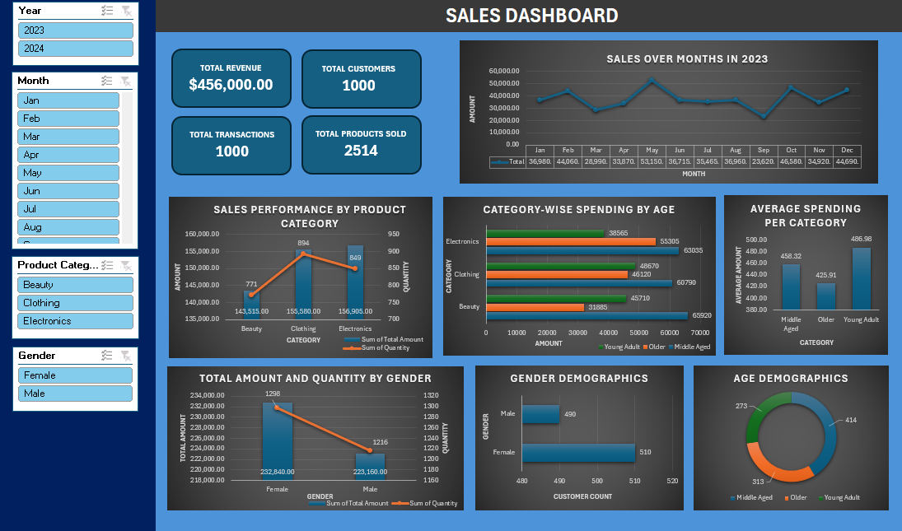

# Excel Sales Dashboard

## 📊 Project Overview
This Excel dashboard analyzes sales data to provide insights on:
- Revenue trends by month
- Gender-based quantity and spending
- Category performance
- Age group purchasing behavior

## 🛠️ Tools Used
- Microsoft Excel
- Pivot Tables
- Excel Formulas (IF, TEXT, MONTH, YEAR)

## 💾 What’s Inside the Excel File
- **Raw Data**: The original transaction data
- **Cleaned Data**: Added Age Group, Year, and Month columns
- **Pivot Tables**: Used to summarize data
- **Dashboard**: Interactive charts and summaries

## 🖼️Dashboard Preview

## 📈 Key Insights
- Most revenue came from the Clothing category
- Middle-aged customers spent the most
- Highest sales were in November 2023

## 📂 Files Included
- `Sales_Dashboard.xlsx`: Full Excel workbook 
- `Images/dashboard.png`: Screenshot of the dashboard
